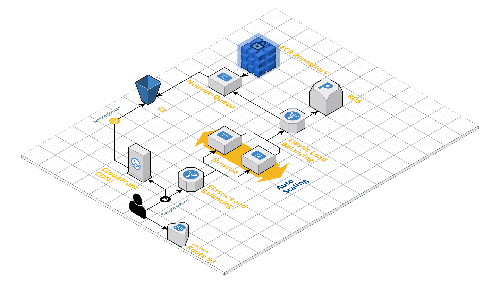

<h3 align=center>Neuvue</h3>
<h6 align=center>A Proofreading web-app and task management system</h6>


## What is Proofreading?

## Installation

Clone this repository recursively so that the neuvue-client submodule will also be included.
```shell
git clone https://github.com/aplbrain/neuvue-app.git --recursive
```

Create a python3 virtual environment and install the requirements in neuvue_project/requirements.txt. 

```shell
python3 -m venv venv
source  venv/bin/activate
cd neuvue_project
pip install -r requirements.txt
```

## (Optional) Compiling the neuroglancer project

A working neuroglancer compilation is included under `neuvue_project/workspace/static/workspace/`. However, if the underlying neuroglancer client needs to change,it must be compiled and linked.

Requirements: [nvm](https://github.com/nvm-sh/nvm)

1. Clone the neuroglancer repo, and build it
	```
	git clone https://github.com/aplbrain/neuroglancer
	nvm install --lts
	cd neuroglancer
	npm i
	npm run build
	npm link
	```

2. Build the NG wrapper
	```
	cd neuvue_project/workspace/static/ts/wrapper
	ln -s <absolute-path-to-neuroglancer>/src/neuroglancer ./third_party/neuroglancer
	npm i
	npm link neuroglancer
	npm run build
	``` 
3. Copy the built files to static
	```
	cd neuvue_project/workspace/static/ts/wrapper
	cp -r dist/workspace ../../
	```

## Running a development environment

There is an included `neuvueDB.sqlite3` database file containing the tables needed to run the Django app. By default, the settings are configured for production which uses a cloud-enabled MySQL database server. To enable development mode: 

Run the following convenience script:
```
python run-dev-server.py
```

Or perform each step individually:

1. Open `neuvue_project/neuvue/settings.py` and set `DEBUG=True`

2. In the same file, modify `NEUVUE_QUEUE_ADDR` variable to the Nuevue-Queue endpoint you would like to use. 

3. Get the recent migrations to the database by running 

	`python manage.py migrate`

4. (OPTIONAL) Create a superuser to modify the app in your development environment.

	`python manage.py createsuperuser`

5. Collect all static files into `/static`:

	`python manage.py collectstatic --no-input`

6. Run the app with the `runserver` command to start a development instance. Run on the localhost:8000 address and port to allow OAuth client to properly authenticate user. 

	`python manage.py runserver localhost:8000`

7. Open your app on http://localhost:8000 


## OAuth Set-up

The included development database is preconfigured to allow OAuth to authetnticate user accounts from `localhost:8000`. Here is a more [complete guide](https://www.section.io/engineering-education/django-google-oauth/) on how this was done.

We use `django-allauth` to connect Google OAuth to the Django environment. Users also have the option to log in through the base allauth login/signup page:

http://localhost:8000/accounts/login/

Django users, OAuth settings, and site configuration can be modified in the admin console. 

http://localhost:8000/admin


## Cloud Blueprint


